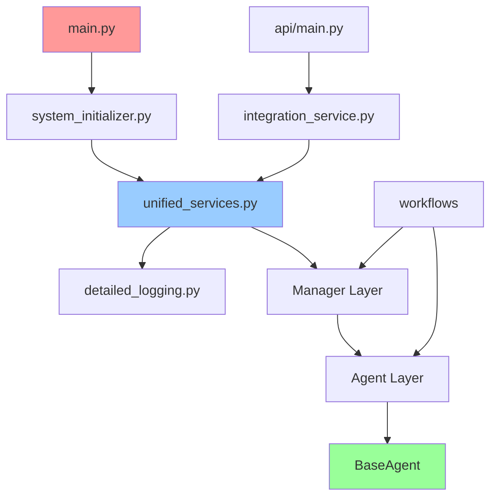

# Legal AI System - Dependency Visualization Strategy

## 🎨 Comprehensive Visualization Approach

Based on the 66 Python files and complex dependency relationships, here are the best visualization strategies:

---

## 1. 🌐 Interactive Network Graph (Recommended Primary)

### **Tool: Cytoscape.js or D3.js**
**Best for**: Overall system architecture and real-time exploration

#### Features:
- **Node Types**: Different shapes/colors for entry points, agents, managers, utilities
- **Edge Types**: Import relationships, function calls, inheritance
- **Interactive**: Click nodes to see details, zoom, pan, filter
- **Layered Layout**: Hierarchical positioning by dependency level

#### Data Format:
```json
{
  "nodes": [
    {"id": "main.py", "type": "entry_point", "level": 5, "dependencies": 2},
    {"id": "unified_services.py", "type": "core", "level": 1, "dependencies": 40},
    {"id": "base_agent.py", "type": "base_class", "level": 3, "dependencies": 15}
  ],
  "edges": [
    {"source": "main.py", "target": "system_initializer.py", "type": "import"},
    {"source": "document_processor.py", "target": "base_agent.py", "type": "inherits"}
  ]
}
```

### **Implementation Options**:
1. **Web-based**: HTML + Cytoscape.js (interactive, shareable)
2. **Python**: NetworkX + Plotly (programmatic generation)
3. **React Component**: For integration with the existing React frontend

---

## 2. 📊 Hierarchical Dependency Diagrams

### **Tool: Draw.io / Lucidchart**
**Best for**: Clean, professional documentation and presentations

#### Diagram Types:

### **2.1 System Architecture Overview**
```
┌─────────────────────────────────────────────┐
│                ENTRY POINTS                  │
│  main.py  │  api/main.py  │  quick_start.py │
└─────────────────┬───────────────────────────┘
                  │
┌─────────────────▼───────────────────────────┐
│              API LAYER                       │
│  integration_service.py  │  FastAPI Routes │
└─────────────────┬───────────────────────────┘
                  │
┌─────────────────▼───────────────────────────┐
│            WORKFLOW LAYER                    │
│  realtime_analysis  │  ultimate_orchestrator│
└─────────────────┬───────────────────────────┘
                  │
┌─────────────────▼───────────────────────────┐
│             AGENT LAYER                      │
│  BaseAgent → 15 Specialized Agents          │
└─────────────────┬───────────────────────────┘
                  │
┌─────────────────▼───────────────────────────┐
│            MANAGER LAYER                     │
│  Vector Store │ Knowledge Graph │ Security  │
└─────────────────┬───────────────────────────┘
                  │
┌─────────────────▼───────────────────────────┐
│           FOUNDATION LAYER                   │
│  unified_services │ detailed_logging        │
└─────────────────────────────────────────────┘
```

### **2.2 Agent Inheritance Tree**
```
                    BaseAgent
                        │
    ┌───────────────────┼───────────────────┐
    │                   │                   │
DocumentProcessor  LegalAnalyzer    ViolationDetector
    │                   │                   │
    └─FullProcessor     └─ CitationAnalysis └─ AutoTagging
                            │
                        EntityExtraction
```

---

## 3. 🔄 Dependency Flow Diagrams

### **Tool: Mermaid.js**
**Best for**: Documentation and GitHub integration

#### Example Mermaid Diagram:


---

## 4. 📈 Dependency Metrics Dashboard

### **Tool: Grafana or Custom React Dashboard**
**Best for**: Understanding system complexity and health

#### Metrics to Visualize:
- **Fan-in/Fan-out**: How many files depend on each module
- **Complexity Score**: Based on number of dependencies
- **Critical Path**: Most important files for system operation
- **Circular Dependencies**: Identified and resolved
- **Optional Dependencies**: External libraries with fallbacks

#### Dashboard Panels:
```
┌─────────────────┬─────────────────┬─────────────────┐
│   Top Dependencies by Usage      │  Complexity Heat Map         │
│   1. detailed_logging.py (66)    │  ████████████░░░             │
│   2. unified_services.py (40)    │  ██████████░░░░░             │
│   3. base_agent.py (15)          │  ████████░░░░░░░             │
├─────────────────┼─────────────────┼─────────────────┤
│   Dependency Depth Distribution  │  Import vs Call Relationships│
│   Level 0: 4 files              │  Imports: 200+              │
│   Level 1: 1 file               │  Function Calls: 150+       │
│   Level 2: 10 files             │  Inheritance: 15             │
└─────────────────┴─────────────────┴─────────────────┘
```

---

## 5. 🗺️ Interactive Code Map

### **Tool: CodeMap or Custom Solution**
**Best for**: Code navigation and understanding

#### Features:
- **File Tree**: Expandable with dependency indicators
- **Heat Map**: Color-coded by dependency count
- **Search**: Find files by name, function, or dependency
- **Filters**: By file type, dependency level, module

---

## 🛠️ Implementation Recommendations

### **Phase 1: Quick Start (1-2 hours)**
1. **Mermaid Diagrams**: Create key dependency flows for documentation
2. **Draw.io**: Create clean system architecture overview
3. **Simple HTML + Cytoscape.js**: Basic interactive network

### **Phase 2: Interactive Web App (1-2 days)**
1. **React Component**: Integrate with existing Legal AI frontend
2. **Real-time Data**: Pull dependency data from analysis
3. **Multiple Views**: Network, hierarchy, metrics

### **Phase 3: Advanced Analytics (3-5 days)**
1. **Dependency Health Dashboard**: Monitor system complexity
2. **Code Impact Analysis**: Predict effects of changes
3. **Architecture Evolution**: Track dependency changes over time

---

## 📋 Data Export Formats

### **For Draw.io**:
```xml
<!-- Hierarchical XML format with nodes and connections -->
<mxGraphModel>
  <root>
    <mxCell id="main.py" vertex="1" parent="1"/>
    <mxCell id="edge1" edge="1" source="main.py" target="system_initializer.py"/>
  </root>
</mxGraphModel>
```

### **For Cytoscape.js**:
```json
{
  "elements": {
    "nodes": [{"data": {"id": "main.py", "type": "entry", "deps": 2}}],
    "edges": [{"data": {"source": "main.py", "target": "system_initializer.py"}}]
  }
}
```

### **For NetworkX/Python**:
```python
import networkx as nx
G = nx.DiGraph()
G.add_node("main.py", type="entry", dependencies=2)
G.add_edge("main.py", "system_initializer.py", type="import")
```

---

## 🎯 Recommended Approach

### **Best Overall Solution**:
1. **Primary**: Interactive React component with Cytoscape.js
2. **Documentation**: Mermaid diagrams in README files
3. **Presentations**: Clean Draw.io architecture diagrams
4. **Analysis**: Python NetworkX for programmatic analysis

### **Why This Combination**:
- ✅ **Interactive exploration** for developers
- ✅ **Professional documentation** for stakeholders  
- ✅ **Programmatic analysis** for maintenance
- ✅ **Integration** with existing React frontend
- ✅ **Multiple perspectives** on the same data

Would you like me to start implementing any of these visualization approaches? I can create the data exports or build the interactive components!