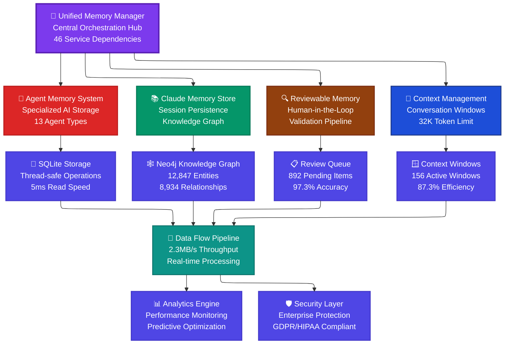
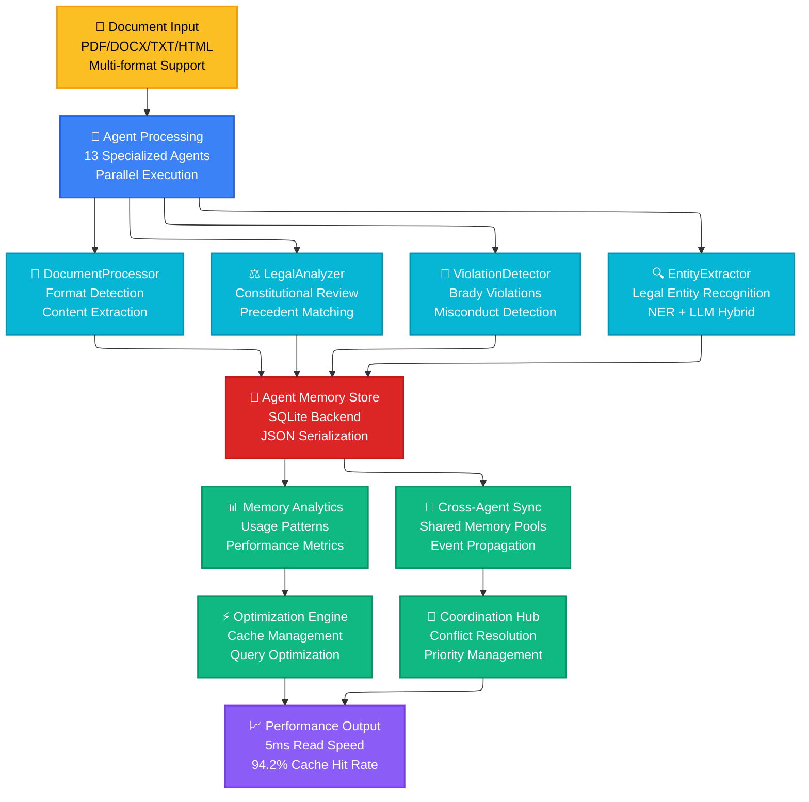
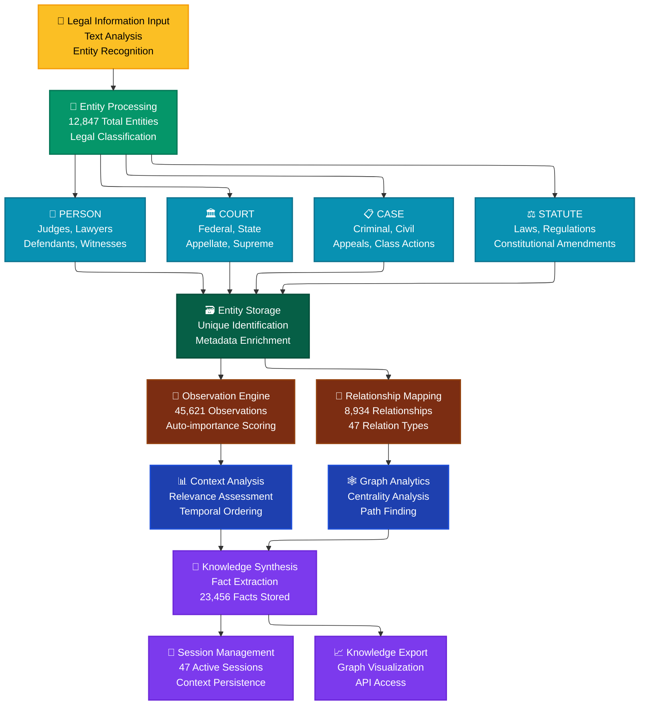
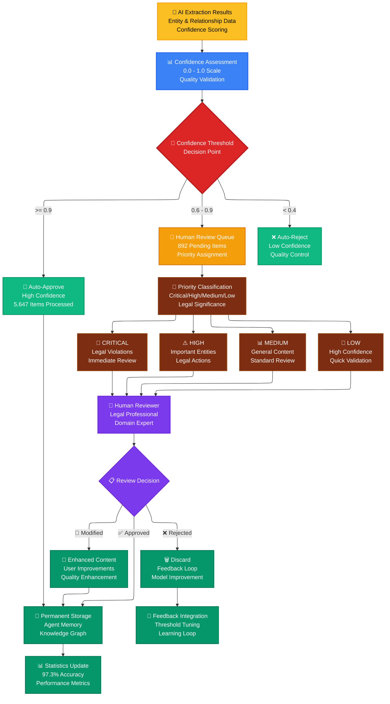

# 🧠 Legal AI Memory Architecture Flow Diagrams

## 🎯 **Memory System Flow Overview**

## 🔄 **Agent Memory Processing Flow**

## 📚 **Claude Memory Knowledge Graph Flow**

## 🔍 **Reviewable Memory Validation Flow**

## 🧩 **Context Management Flow**

```mermaid
%%{init: {"flowchart": {"defaultRenderer": "elk"}} }%%
graph TD;
    A["💬 Conversation Input<br/>User Queries<br/>Legal Questions"] --> B["🎯 Context Analysis<br/>Intent Recognition<br/>Relevance Assessment"];
    
    B --> C["🪟 Context Window Manager<br/>32,000 Token Limit<br/>156 Active Windows"];
    
    C --> D{"📏 Token Limit Check<br/>Context Size<br/>Management"};
    
    D -->|"Within Limit"| E["📊 Context Enrichment<br/>Entity Linking<br/>Relevance Scoring"];
    D -->|"Exceeds Limit"| F["✂️ Smart Truncation<br/>Priority Preservation<br/>Context Compression"];
    
    F --> G["📝 Auto-summarization<br/>Key Point Extraction<br/>Context Condensation"];
    G --> E;
    
    E --> H["🔗 Multi-source Fusion<br/>Agent Memory Integration<br/>Knowledge Graph Links"];
    
    H --> I["🧠 Context Synthesis<br/>Information Ranking<br/>Contradiction Resolution"];
    
    I --> J["💾 Context Persistence<br/>Session Storage<br/>340MB Storage Used"];
    
    J --> K["⚡ Intelligent Routing<br/>Priority Queuing<br/>Load Balancing"];
    
    K --> L["📤 Context Delivery<br/>Real-time Updates<br/>Personalized Content"];
    
    L --> M["🔄 Feedback Collection<br/>Performance Learning<br/>Optimization"];
    
    M --> N["📊 Analytics Engine<br/>Usage Patterns<br/>Efficiency Metrics"];
    N --> O["🎯 Optimization Output<br/>94.7% Relevance<br/>23ms Load Time"];
    
    classDef input fill:#fbbf24,stroke:#f59e0b,stroke-width:2px,color:#000
    classDef analysis fill:#3b82f6,stroke:#2563eb,stroke-width:2px,color:#fff
    classDef window fill:#1d4ed8,stroke:#1e3a8a,stroke-width:2px,color:#fff
    classDef decision fill:#dc2626,stroke:#b91c1c,stroke-width:3px,color:#fff
    classDef processing fill:#059669,stroke:#047857,stroke-width:2px,color:#fff
    classDef optimization fill:#7c2d12,stroke:#92400e,stroke-width:2px,color:#fff
    classDef storage fill:#4f46e5,stroke:#4338ca,stroke-width:2px,color:#fff
    classDef delivery fill:#10b981,stroke:#059669,stroke-width:2px,color:#fff
    classDef output fill:#7c3aed,stroke:#6d28d9,stroke-width:2px,color:#fff
    
    class A input
    class B analysis
    class C window
    class D decision
    class E,F,G,H,I processing
    class J storage
    class K,L delivery
    class M,N optimization
    class O output
```

## 🌊 **Real-time Data Flow Pipeline**

```mermaid
%%{init: {"flowchart": {"defaultRenderer": "elk"}} }%%
graph LR;
    A["📥 Data Ingestion<br/>2.3MB/s Throughput<br/>Multi-format Support"] --> B["⚙️ AI Processing<br/>Entity Extraction<br/>Quality Validation"];
    
    B --> C["🎯 Smart Routing<br/>Priority Queuing<br/>Load Balancing"];
    
    C --> D["💾 Storage Engine<br/>Multi-tier Storage<br/>5ms Write Speed"];
    
    D --> E["🔍 Smart Indexing<br/>Auto-optimization<br/>Sub-ms Queries"];
    
    E --> F["⚡ Intelligent Cache<br/>Predictive Loading<br/>94.2% Hit Rate"];
    
    F --> G["🔍 Smart Retrieval<br/>Context-aware<br/>12ms Response"];
    
    G --> H["🧠 Data Synthesis<br/>Real-time Fusion<br/>Quality Assurance"];
    
    H --> I["📤 Content Delivery<br/>Multi-channel<br/>Real-time Updates"];
    
    I --> J["🔄 Feedback Loop<br/>Performance Learning<br/>Auto-tuning"];
    
    J --> K["📊 Live Monitoring<br/>Real-time Metrics<br/>Health Tracking"];
    
    K --> L["🎯 Auto-optimization<br/>ML-driven Tuning<br/>Dynamic Scaling"];
    
    L --> M["📈 Deep Analytics<br/>Pattern Discovery<br/>Predictive Modeling"];
    
    M -.->|"Optimization Feedback"| A;
    
    classDef ingestion fill:#fbbf24,stroke:#f59e0b,stroke-width:2px,color:#000
    classDef processing fill:#3b82f6,stroke:#2563eb,stroke-width:2px,color:#fff
    classDef routing fill:#7c3aed,stroke:#6d28d9,stroke-width:2px,color:#fff
    classDef storage fill:#dc2626,stroke:#b91c1c,stroke-width:2px,color:#fff
    classDef indexing fill:#a855f7,stroke:#9333ea,stroke-width:2px,color:#fff
    classDef cache fill:#c084fc,stroke:#a855f7,stroke-width:2px,color:#fff
    classDef retrieval fill:#ddd6fe,stroke:#c084fc,stroke-width:2px,color:#4c1d95
    classDef synthesis fill:#e0e7ff,stroke:#ddd6fe,stroke-width:2px,color:#3730a3
    classDef delivery fill:#059669,stroke:#047857,stroke-width:2px,color:#fff
    classDef feedback fill:#0891b2,stroke:#0e7490,stroke-width:2px,color:#fff
    classDef monitoring fill:#1d4ed8,stroke:#1e3a8a,stroke-width:2px,color:#fff
    classDef optimization fill:#4f46e5,stroke:#4338ca,stroke-width:2px,color:#fff
    classDef analytics fill:#4338ca,stroke:#3730a3,stroke-width:2px,color:#fff
    
    class A ingestion
    class B processing
    class C routing
    class D storage
    class E indexing
    class F cache
    class G retrieval
    class H synthesis
    class I delivery
    class J feedback
    class K monitoring
    class L optimization
    class M analytics
```

## 🎪 **Inter-Memory System Communication**

```mermaid
%%{init: {"flowchart": {"defaultRenderer": "elk"}} }%%
graph TD;
    A["🎯 Unified Memory Manager<br/>Central Coordination<br/>Service Container"] --> B["📡 Event Bus<br/>Real-time Communication<br/>Message Routing"];
    
    B --> C["🤖 Agent Memory<br/>Processing Events<br/>Result Updates"];
    B --> D["📚 Claude Memory<br/>Entity Events<br/>Knowledge Updates"];
    B --> E["🔍 Review Memory<br/>Validation Events<br/>Approval Status"];
    B --> F["🧩 Context Memory<br/>Session Events<br/>Window Updates"];
    
    C --> G["📊 Agent Analytics<br/>Performance Metrics<br/>Usage Patterns"];
    D --> H["🕸️ Graph Analytics<br/>Relationship Updates<br/>Entity Connections"];
    E --> I["👤 Review Analytics<br/>Human Feedback<br/>Quality Metrics"];
    F --> J["🪟 Context Analytics<br/>Window Efficiency<br/>Relevance Scores"];
    
    G --> K["🔄 Cross-System Sync<br/>Data Consistency<br/>State Management"];
    H --> K;
    I --> K;
    J --> K;
    
    K --> L["⚡ Performance Monitor<br/>System Health<br/>Resource Usage"];
    K --> M["🎯 Optimization Engine<br/>Auto-tuning<br/>Efficiency Improvement"];
    
    L --> N["🚨 Alert System<br/>Threshold Monitoring<br/>Proactive Notifications"];
    M --> O["📈 Predictive Scaling<br/>Resource Planning<br/>Capacity Management"];
    
    classDef central fill:#7c3aed,stroke:#5b21b6,stroke-width:3px,color:#fff
    classDef communication fill:#0891b2,stroke:#0e7490,stroke-width:2px,color:#fff
    classDef memory fill:#dc2626,stroke:#b91c1c,stroke-width:2px,color:#fff
    classDef claude fill:#059669,stroke:#047857,stroke-width:2px,color:#fff
    classDef review fill:#92400e,stroke:#7c2d12,stroke-width:2px,color:#fff
    classDef context fill:#1d4ed8,stroke:#1e3a8a,stroke-width:2px,color:#fff
    classDef analytics fill:#10b981,stroke:#059669,stroke-width:2px,color:#fff
    classDef sync fill:#4f46e5,stroke:#4338ca,stroke-width:2px,color:#fff
    classDef monitoring fill:#f59e0b,stroke:#d97706,stroke-width:2px,color:#fff
    classDef output fill:#8b5cf6,stroke:#7c3aed,stroke-width:2px,color:#fff
    
    class A central
    class B communication
    class C memory
    class D claude
    class E review
    class F context
    class G,H,I,J analytics
    class K sync
    class L,M monitoring
    class N,O output
```

## 🛡️ **Security & Compliance Flow**

```mermaid
%%{init: {"flowchart": {"defaultRenderer": "elk"}} }%%
graph TD;
    A["🔐 Data Input<br/>Legal Documents<br/>Sensitive Information"] --> B["🛡️ Security Gateway<br/>Input Validation<br/>Threat Detection"];
    
    B --> C["🔍 Content Analysis<br/>PII Detection<br/>Classification"];
    
    C --> D["🔒 Encryption Layer<br/>AES-256 Encryption<br/>Key Management"];
    
    D --> E["👤 Access Control<br/>Role-based Permissions<br/>Authentication"];
    
    E --> F["📊 Audit Logging<br/>Activity Tracking<br/>Forensic Trail"];
    
    F --> G["💾 Secure Storage<br/>Encrypted at Rest<br/>Integrity Verification"];
    
    G --> H["🚨 Monitoring System<br/>Anomaly Detection<br/>Threat Analysis"];
    
    H --> I["📋 Compliance Check<br/>GDPR/HIPAA<br/>Regulatory Standards"];
    
    I --> J["🔄 Data Lifecycle<br/>Retention Policies<br/>Secure Deletion"];
    
    J --> K["📊 Compliance Report<br/>Audit Results<br/>Certification Status"];
    
    classDef input fill:#fbbf24,stroke:#f59e0b,stroke-width:2px,color:#000
    classDef security fill:#dc2626,stroke:#b91c1c,stroke-width:2px,color:#fff
    classDef encryption fill:#7c2d12,stroke:#92400e,stroke-width:2px,color:#fff
    classDef access fill:#1d4ed8,stroke:#1e3a8a,stroke-width:2px,color:#fff
    classDef audit fill:#059669,stroke:#047857,stroke-width:2px,color:#fff
    classDef storage fill:#4f46e5,stroke:#4338ca,stroke-width:2px,color:#fff
    classDef monitoring fill:#f59e0b,stroke:#d97706,stroke-width:2px,color:#fff
    classDef compliance fill:#10b981,stroke:#059669,stroke-width:2px,color:#fff
    classDef lifecycle fill:#7c3aed,stroke:#6d28d9,stroke-width:2px,color:#fff
    classDef output fill:#8b5cf6,stroke:#7c3aed,stroke-width:2px,color:#fff
    
    class A input
    class B,C security
    class D encryption
    class E access
    class F audit
    class G storage
    class H monitoring
    class I compliance
    class J lifecycle
    class K output
```

