# Legal AI System - Ultra-Detailed Dependency Flow Diagrams 🏛️⚖️

## 🧠 Core Service Container Flow - The Neural Network

```mermaid
%%{init: {"flowchart": {"defaultRenderer": "elk"}} }%%
graph TD;
    A["🎯 unified_services.py<br/>💉 Dependency Injection Hub<br/>⚡ 46 Service Dependencies<br/>🔄 Lifecycle Management<br/>📊 Health Monitoring"] --> B["🏗️ ServiceContainer<br/>🎪 Circuit Breaker Pattern<br/>⚡ Lazy Loading<br/>🔧 Auto-recovery<br/>📈 Performance Metrics"];
    
    B --> C["🔑 get_service_container()<br/>🌍 Global Access Point<br/>🎯 Type-safe Returns<br/>⚡ Thread-safe Singleton<br/>🔄 Auto-initialization"];
    
    %% API Layer - The Gateway
    C --> E1["🚀 api/main.py<br/>⚡ FastAPI Async Server<br/>🔐 JWT Authentication<br/>📊 GraphQL + REST<br/>🔌 WebSocket Real-time<br/>📝 OpenAPI Docs<br/>🛡️ CORS Security"];
    C --> E2["🔗 api/integration_service.py<br/>🎯 Service Orchestration<br/>🔄 Request/Response Mapping<br/>⚡ Async Task Management<br/>🎪 Workflow Coordination<br/>📊 Performance Monitoring"];
    
    %% Core Infrastructure - The Brain
    C --> F1["🤖 core/llm_providers.py<br/>🧠 Multi-LLM Strategy<br/>🚀 xAI/Grok Primary<br/>🏠 Ollama Fallback<br/>🌐 OpenAI Backup<br/>⚡ Auto-failover Logic<br/>💰 Cost Optimization"];
    C --> F2["🔄 core/model_switcher.py<br/>🎯 Dynamic Model Selection<br/>📊 Task Complexity Analysis<br/>⚡ grok-3-mini → Fast<br/>🔬 grok-3-reasoning → Complex<br/>⚖️ grok-2-1212 → Balanced"];
    C --> F3["🛡️ core/security_manager.py<br/>🔐 Authentication Layer<br/>🔏 Input Validation<br/>🚨 Threat Detection<br/>📊 Access Control<br/>🎯 Audit Logging"];
    C --> F4["⚙️ core/configuration_manager.py<br/>🔧 Dynamic Configuration<br/>🌍 Environment Management<br/>🔄 Hot-reload Settings<br/>📊 Validation Rules<br/>🎯 Feature Flags"];
    
    %% Storage Powerhouses
    C --> F5["🕸️ core/knowledge_graph_enhanced.py<br/>🔗 Neo4j Integration<br/>⚖️ Legal Entity Relationships<br/>🏛️ Case Law Connections<br/>👥 Person-Document Links<br/>📊 Cypher Query Engine<br/>🎯 Graph Analytics"];
    C --> F6["🔍 core/vector_store_enhanced.py<br/>⚡ FAISS High-Speed Search<br/>📊 LanceDB Structured Storage<br/>🎯 Hybrid Similarity Matching<br/>🧠 384D Embeddings<br/>📈 ANN Optimization<br/>🔄 Auto-indexing"];
    C --> F7["🧠 core/unified_memory_manager.py<br/>💾 Session Memory<br/>🔄 Context Management<br/>📝 Auto-summarization<br/>🎯 Smart Context Windows<br/>⚡ Memory Optimization<br/>🗂️ Multi-session Support"];
    
    %% Error Handling & Recovery
    C --> F8["🚨 core/error_recovery.py<br/>🔄 Circuit Breaker Pattern<br/>⚡ Auto-retry Logic<br/>🛡️ Graceful Degradation<br/>📊 Failure Analytics<br/>🎯 Recovery Strategies<br/>⏰ Exponential Backoff"];
    C --> F9["🗺️ core/document_router.py<br/>🎯 Intelligent Routing<br/>📄 File Type Detection<br/>🔄 Processing Pipeline<br/>⚡ Load Balancing<br/>📊 Queue Management"];
    
    %% AI Agents - The Specialists
    C --> G1["📄 agents/document_processor.py<br/>🔄 Multi-format Support<br/>📝 PDF + DOCX + TXT + HTML<br/>🖼️ OCR Integration<br/>📊 XLSX Database Schema<br/>⚡ Async Processing<br/>🎯 Progress Tracking"];
    C --> G2["🏷️ agents/auto_tagging.py<br/>🧠 Learning-based Tagging<br/>👤 User Behavior Analysis<br/>📊 Confidence Scoring<br/>🔄 Continuous Learning<br/>🎯 Smart Suggestions"];
    C --> G3["🔍 agents/entity_extraction.py<br/>👥 Legal Entity Recognition<br/>🏛️ Court + Judge + Lawyer<br/>📋 Case + Evidence + Statute<br/>🎯 Hybrid NER + LLM<br/>⚡ Blackstone Model<br/>📊 Confidence Calibration"];
    C --> G4["⚖️ agents/violation_detector.py<br/>🚨 Brady Violation Detection<br/>⚖️ Prosecutorial Misconduct<br/>🎯 Witness Tampering<br/>📊 Pattern Recognition<br/>🔍 Cross-reference Analysis"];
    C --> G5["📚 agents/legal_analysis.py<br/>🏛️ Constitutional Analysis<br/>⚖️ Precedent Matching<br/>📊 Case Law Research<br/>🎯 Legal Reasoning<br/>📝 Citation Generation"];
    C --> G6["📝 agents/note_taking.py<br/>🧠 Context-aware Notes<br/>🔗 Auto-linking Entities<br/>📊 Smart Categorization<br/>🎯 Relevance Scoring<br/>🔄 Real-time Updates"];
    
    %% Workflow Orchestration
    C --> H1["🎪 workflows/ultimate_orchestrator.py<br/>🎯 Master Workflow Engine<br/>🔄 LangGraph Integration<br/>📊 State Management<br/>⚡ Parallel Processing<br/>🎪 Dynamic Routing<br/>📈 Performance Optimization"];
    C --> H2["⚡ workflows/realtime_analysis_workflow.py<br/>🔄 Real-time Pipeline<br/>📄 Document → Extraction<br/>🕸️ Graph → Vector Update<br/>🧠 Memory Integration<br/>📊 Progress Streaming"];
    
    %% Service Container Internals
    B --> I["🔄 LazyServiceProxy<br/>🧩 Circular Dependency Resolution<br/>⚡ On-demand Initialization<br/>🔧 Dynamic Service Loading<br/>🎯 Type-safe Proxies<br/>📊 Load Balancing"];
    I --> J["🔧 Resolves Circular Dependencies<br/>📊 Dependency Graph Analysis<br/>🔄 Topological Sorting<br/>⚡ Smart Initialization Order"];
    
    B --> K["⚡ ServiceState Enum<br/>📊 Real-time State Tracking<br/>🔄 Atomic State Transitions<br/>📈 Health Monitoring"];
    K --> L["🔄 INITIALIZING<br/>⚡ Loading Dependencies<br/>🔧 Configuration Validation<br/>📊 Resource Allocation"];
    K --> M["✅ RUNNING<br/>🎯 Active Processing<br/>📊 Performance Monitoring<br/>🔄 Health Checks"];
    K --> N["⏸️ SHUTTING_DOWN<br/>🧹 Graceful Cleanup<br/>💾 State Persistence<br/>🔄 Resource Release"];
    K --> O["🛑 SHUTDOWN<br/>✅ Complete Termination<br/>📊 Final Metrics<br/>🔒 Safe Exit"];
    
    %% Performance Metrics
    B --> P["📊 ServiceMetrics<br/>⏱️ Response Time: 250ms avg<br/>🔥 CPU Usage: 15-30%<br/>💾 Memory: 2-4GB peak<br/>📈 Throughput: 50 docs/min<br/>✅ Uptime: 99.9%"];
    
    %% Styling
    classDef coreService fill:#e74c3c,stroke:#c0392b,stroke-width:3px,color:#fff
    classDef apiLayer fill:#f39c12,stroke:#d68910,stroke-width:2px,color:#fff
    classDef agent fill:#3498db,stroke:#2980b9,stroke-width:2px,color:#fff
    classDef workflow fill:#9b59b6,stroke:#8e44ad,stroke-width:2px,color:#fff
    classDef storage fill:#2ecc71,stroke:#27ae60,stroke-width:2px,color:#fff
    
    class A,B,C coreService
    class E1,E2 apiLayer
    class G1,G2,G3,G4,G5,G6 agent
    class H1,H2 workflow
    class F5,F6,F7 storage
```

## 🤖 AI Agent Ecosystem - The Specialists

```mermaid
%%{init: {"flowchart": {"defaultRenderer": "elk"}} }%%
graph TD;
    A["🎯 agents/base_agent.py<br/>🏗️ Abstract Base Framework<br/>⚡ Async Processing Core<br/>📊 Status Management<br/>🔄 Lifecycle Hooks<br/>🎯 Error Handling<br/>📈 Performance Tracking"] --> B["🧠 BaseAgent Core Features<br/>⚡ AgentStatus Enum<br/>🎯 TaskPriority System<br/>📊 Progress Tracking<br/>🔄 Cancellation Support<br/>⏰ Timeout Management"];
    
    %% Document Processing Specialists
    A --> C1["📄 DocumentProcessorAgent<br/>🔄 Multi-format Master<br/>📝 PDF → PyMuPDF Magic<br/>📋 DOCX → python-docx<br/>🌐 HTML → BeautifulSoup<br/>📊 XLSX → Pandas Power<br/>🖼️ Images → Tesseract OCR<br/>⚡ 15+ Format Support"];
    C1 --> C1a["📊 Processing Strategies<br/>🎯 FULL_PROCESSING<br/>📋 STRUCTURED_DATA<br/>🖼️ REFERENCE_ONLY<br/>⚡ Smart Auto-detection"];
    
    %% Legal Analysis Powerhouses
    A --> D1["⚖️ LegalAnalyzerAgent<br/>🏛️ Constitutional Expert<br/>📚 Case Law Researcher<br/>⚖️ Precedent Matcher<br/>🎯 Legal Reasoning Engine<br/>📝 Citation Generator<br/>📊 Confidence Scoring"];
    D1 --> D1a["🏛️ Analysis Capabilities<br/>⚖️ Constitutional Review<br/>📚 Statute Interpretation<br/>🎯 Jurisdictional Analysis<br/>📊 Legal Risk Assessment"];
    
    A --> D2["🚨 ViolationDetectorAgent<br/>⚖️ Brady Violation Hunter<br/>🕵️ Prosecutorial Misconduct<br/>👥 Witness Tampering<br/>📊 Pattern Recognition<br/>🎯 Cross-reference Analysis<br/>🔍 Evidence Suppression"];
    D2 --> D2a["🚨 Violation Types<br/>⚖️ Brady Material<br/>🕵️ Due Process<br/>👥 Witness Issues<br/>📊 Discovery Violations"];
    
    %% Entity Extraction Masters
    A --> E1["🔍 EntityExtractionAgent<br/>👥 Legal Entity Recognition<br/>🏛️ Court + Judge + Lawyer<br/>📋 Case + Evidence + Statute<br/>🎯 Hybrid NER + LLM<br/>⚡ Blackstone Model<br/>📊 spaCy + Flair Power"];
    E1 --> E1a["👥 Entity Categories<br/>🏛️ Judicial Entities<br/>👤 Person Entities<br/>📋 Legal Documents<br/>⚖️ Legal Concepts<br/>📍 Locations + Dates"];
    
    A --> E2["🧬 OntologyExtractionAgent<br/>🎯 20+ Legal Entity Types<br/>🔗 Relationship Mapping<br/>⚖️ Filed_By + Supports<br/>🏛️ Presided_By Relations<br/>📊 Confidence Validation<br/>🎪 Pattern Matching"];
    E2 --> E2a["🔗 Relationship Types<br/>⚖️ Filed_By<br/>📊 Supports/Refutes<br/>🏛️ Presided_By<br/>👥 Represents<br/>📋 References"];
    
    %% Smart Automation Agents
    A --> F1["🏷️ AutoTaggingAgent<br/>🧠 Learning-based System<br/>👤 User Behavior Analysis<br/>📊 Confidence Scoring<br/>🔄 Continuous Learning<br/>🎯 Smart Suggestions<br/>📈 Accuracy Improvement"];
    F1 --> F1a["🧠 Learning Features<br/>👤 User Pattern Analysis<br/>📊 Tag Frequency Tracking<br/>🎯 Context Understanding<br/>🔄 Feedback Loop"];
    
    A --> F2["📝 NoteTakingAgent<br/>🧠 Context-aware Notes<br/>🔗 Auto-linking Entities<br/>📊 Smart Categorization<br/>🎯 Relevance Scoring<br/>🔄 Real-time Updates<br/>🎪 Cross-document Links"];
    F2 --> F2a["📝 Note Features<br/>🔗 Entity Auto-linking<br/>📊 Importance Scoring<br/>🎯 Topic Clustering<br/>🔄 Live Updates"];
    
    %% Analysis Specialists
    A --> G1["🔍 SemanticAnalysisAgent<br/>🧠 Meaning Extraction<br/>📊 Topic Modeling<br/>🎯 Concept Clustering<br/>🔗 Semantic Similarity<br/>📈 Vector Embeddings<br/>⚡ Transformer Models"];
    G1 --> G1a["🧠 Semantic Capabilities<br/>📊 Topic Extraction<br/>🎯 Concept Mapping<br/>🔗 Similarity Analysis<br/>📈 Embedding Generation"];
    
    A --> G2["🏗️ StructuralAnalysisAgent<br/>📋 Document Structure<br/>📊 Section Analysis<br/>🎯 Hierarchy Detection<br/>📝 Formatting Analysis<br/>🔗 Cross-references<br/>📈 Content Organization"];
    G2 --> G2a["🏗️ Structure Analysis<br/>📋 Section Hierarchy<br/>📊 Content Flow<br/>🎯 Reference Mapping<br/>📝 Format Recognition"];
    
    A --> G3["✏️ TextCorrectionAgent<br/>📝 Grammar Enhancement<br/>🔤 Spelling Correction<br/>🎯 Style Improvement<br/>📊 Readability Analysis<br/>⚡ Language Model Power<br/>🔄 Iterative Refinement"];
    G3 --> G3a["✏️ Correction Features<br/>📝 Grammar Fixes<br/>🔤 Spell Check<br/>🎯 Style Enhancement<br/>📊 Clarity Improvement"];
    
    %% Knowledge Management
    A --> H1["📚 KnowledgeBaseAgent<br/>🧠 Knowledge Management<br/>📊 Information Retrieval<br/>🎯 Query Processing<br/>🔗 Relationship Mapping<br/>📈 Knowledge Updates<br/>⚡ Real-time Sync"];
    H1 --> H1a["📚 Knowledge Features<br/>🧠 Smart Retrieval<br/>📊 Query Understanding<br/>🎯 Context Matching<br/>🔗 Graph Navigation"];
    
    A --> H2["📖 CitationAnalysisAgent<br/>📚 Citation Validation<br/>🎯 Format Standardization<br/>🔗 Reference Verification<br/>📊 Authority Ranking<br/>⚖️ Legal Citation Rules<br/>📈 Quality Assessment"];
    H2 --> H2a["📖 Citation Features<br/>📚 Format Validation<br/>🎯 Bluebook Compliance<br/>🔗 Link Verification<br/>📊 Authority Analysis"];
    
    %% Service Integration Points
    B --> I["🔗 Service Dependencies<br/>🎯 get_service_container()<br/>🧠 LLM Provider Access<br/>📊 Vector Store Integration<br/>🕸️ Knowledge Graph Updates<br/>💾 Memory Management<br/>🔒 Security Validation"];
    
    %% Performance Metrics
    B --> J["📊 Agent Performance<br/>⚡ Avg Processing: 2-5s<br/>🎯 Accuracy: 92-98%<br/>📈 Throughput: 100+ docs/hr<br/>💾 Memory Usage: 500MB-2GB<br/>🔄 Concurrent Tasks: 10+"];
    
    %% Styling
    classDef baseAgent fill:#34495e,stroke:#2c3e50,stroke-width:3px,color:#fff
    classDef docAgent fill:#e67e22,stroke:#d35400,stroke-width:2px,color:#fff
    classDef legalAgent fill:#e74c3c,stroke:#c0392b,stroke-width:2px,color:#fff
    classDef extractAgent fill:#3498db,stroke:#2980b9,stroke-width:2px,color:#fff
    classDef smartAgent fill:#9b59b6,stroke:#8e44ad,stroke-width:2px,color:#fff
    classDef analysisAgent fill:#2ecc71,stroke:#27ae60,stroke-width:2px,color:#fff
    classDef knowledgeAgent fill:#f39c12,stroke:#d68910,stroke-width:2px,color:#fff
    
    class A,B baseAgent
    class C1,C1a docAgent
    class D1,D1a,D2,D2a legalAgent
    class E1,E1a,E2,E2a extractAgent
    class F1,F1a,F2,F2a smartAgent
    class G1,G1a,G2,G2a,G3,G3a analysisAgent
    class H1,H1a,H2,H2a knowledgeAgent
```

## 🚀 LLM Provider Ecosystem - The AI Brain Trust

```mermaid
%%{init: {"flowchart": {"defaultRenderer": "elk"}} }%%
graph TD;
    A["🤖 core/llm_providers.py<br/>🧠 Multi-LLM Strategy Hub<br/>⚡ Provider Abstraction<br/>🔄 Automatic Failover<br/>💰 Cost Optimization<br/>📊 Performance Monitoring<br/>🎯 Load Balancing"] --> B["🏗️ BaseLLMProvider<br/>🎯 Abstract Interface<br/>⚡ Async Processing<br/>📊 Response Standardization<br/>🔄 Error Handling<br/>⏰ Timeout Management"];
    
    %% Primary Provider - xAI/Grok
    B --> C1["🚀 XAIProvider (PRIMARY)<br/>🧠 Grok Model Family<br/>⚡ Lightning Fast Responses<br/>🎯 Legal Domain Optimized<br/>💰 Cost Effective<br/>📊 High Accuracy<br/>🔗 REST API Integration"];
    C1 --> C1a["🧠 grok-3-mini<br/>⚡ Speed Champion<br/>🎯 Quick Analysis<br/>📄 Document Classification<br/>🏷️ Auto-tagging Tasks<br/>💰 Ultra Low Cost<br/>⏱️ 100-500ms Response"];
    C1 --> C1b["🔬 grok-3-reasoning<br/>🧠 Deep Thinking Engine<br/>⚖️ Constitutional Analysis<br/>🎯 Complex Legal Logic<br/>📊 Multi-step Reasoning<br/>🏛️ Case Law Research<br/>⏱️ 2-10s Response"];
    C1 --> C1c["⚖️ grok-2-1212<br/>🎯 Balanced Performer<br/>📊 General Legal Tasks<br/>🔄 Workflow Processing<br/>💰 Mid-tier Cost<br/>⚡ Reliable Output<br/>⏱️ 500ms-2s Response"];
    
    %% Model Switcher Intelligence
    A --> D["🔄 core/model_switcher.py<br/>🎯 Dynamic Model Selection<br/>📊 Task Complexity Analysis<br/>⚡ Automatic Switching<br/>💰 Cost Optimization<br/>🎪 Performance Monitoring<br/>🔧 Manual Override Support"];
    D --> D1["📊 TaskComplexity Engine<br/>🎯 SIMPLE → grok-3-mini<br/>🔄 MEDIUM → grok-2-1212<br/>🧠 COMPLEX → grok-3-reasoning<br/>📈 Learning Algorithm<br/>⚡ Context Analysis"];
    D --> D2["💰 Cost Optimization<br/>📊 Usage Analytics<br/>🎯 Budget Management<br/>⚡ Efficiency Scoring<br/>📈 ROI Tracking<br/>🔄 Auto-adjustment"];
    
    %% Fallback Providers
    B --> E1["🏠 OllamaProvider (FALLBACK)<br/>🔒 Privacy Champion<br/>💻 Local Processing<br/>🛡️ Offline Capability<br/>🔐 Sensitive Documents<br/>⚡ No API Limits<br/>🎯 Custom Model Support"];
    E1 --> E1a["🦙 llama3.2 Model<br/>🧠 8B Parameter Power<br/>⚡ Fast Local Inference<br/>📊 General Capability<br/>🔒 Complete Privacy<br/>💻 GPU Accelerated"];
    E1 --> E1b["📝 nomic-embed-text<br/>🎯 Embedding Specialist<br/>📊 768D Vectors<br/>⚡ Local Generation<br/>🔍 Similarity Search<br/>🧠 Semantic Understanding"];
    
    B --> E2["🌐 OpenAIProvider (BACKUP)<br/>☁️ Cloud Powerhouse<br/>🧠 GPT Model Family<br/>📊 Proven Reliability<br/>🎯 Enterprise Grade<br/>⚡ High Availability<br/>🔄 Global Infrastructure"];
    E2 --> E2a["🧠 GPT-4 Turbo<br/>🎯 Premium Intelligence<br/>📊 128K Context Window<br/>⚡ Advanced Reasoning<br/>💰 Premium Pricing<br/>🔒 Enterprise Security"];
    E2 --> E2b["⚡ GPT-3.5 Turbo<br/>🎯 Balanced Performance<br/>📊 16K Context<br/>💰 Cost Effective<br/>⚡ Fast Response<br/>🔄 High Throughput"];
    
    %% Provider Management
    A --> F["🎪 LLMManager<br/>🔄 Provider Orchestration<br/>⚡ Health Monitoring<br/>📊 Load Balancing<br/>🎯 Request Routing<br/>💰 Cost Tracking<br/>🔧 Configuration Management"];
    F --> F1["⚡ Health Checks<br/>🎯 Response Time Monitoring<br/>📊 Error Rate Tracking<br/>🔄 Availability Status<br/>💾 Memory Usage<br/>⚡ Throughput Metrics"];
    F --> F2["🔄 Failover Logic<br/>🎯 Primary → Fallback<br/>⚡ Automatic Recovery<br/>📊 Circuit Breaker<br/>🔧 Manual Override<br/>⏰ Retry Policies"];
    
    %% Response Processing
    A --> G["📊 LLMResponse Processing<br/>🎯 Standardized Format<br/>📈 Confidence Scoring<br/>⏱️ Timing Metrics<br/>🔄 Error Handling<br/>📊 Quality Assessment<br/>🎪 Result Caching"];
    G --> G1["📈 Quality Metrics<br/>🎯 Response Relevance<br/>📊 Accuracy Scoring<br/>⚡ Speed Assessment<br/>💰 Cost Analysis<br/>🔄 User Satisfaction"];
    
    %% Configuration & Optimization
    A --> H["⚙️ Provider Configuration<br/>🔧 API Key Management<br/>🌍 Environment Settings<br/>📊 Rate Limiting<br/>⚡ Timeout Configuration<br/>💰 Budget Controls<br/>🎯 Feature Flags"];
    H --> H1["🔒 Security Features<br/>🔐 API Key Encryption<br/>🛡️ Request Validation<br/>📊 Audit Logging<br/>🎯 Access Control<br/>⚡ Rate Protection"];
    
    %% Performance Dashboard
    A --> I["📊 Performance Dashboard<br/>⚡ Avg Response: 250ms<br/>🎯 Success Rate: 99.5%<br/>💰 Cost/Request: $0.002<br/>📈 Requests/Min: 200+<br/>🔄 Uptime: 99.9%<br/>🧠 Model Distribution"];
    
    %% Styling
    classDef primaryProvider fill:#e74c3c,stroke:#c0392b,stroke-width:3px,color:#fff
    classDef fallbackProvider fill:#3498db,stroke:#2980b9,stroke-width:2px,color:#fff
    classDef backupProvider fill:#2ecc71,stroke:#27ae60,stroke-width:2px,color:#fff
    classDef management fill:#f39c12,stroke:#d68910,stroke-width:2px,color:#fff
    classDef switching fill:#9b59b6,stroke:#8e44ad,stroke-width:2px,color:#fff
    
    class A,B primaryProvider
    class C1,C1a,C1b,C1c primaryProvider
    class D,D1,D2 switching
    class E1,E1a,E1b fallbackProvider
    class E2,E2a,E2b backupProvider
    class F,F1,F2,G,G1,H,H1,I management
```

