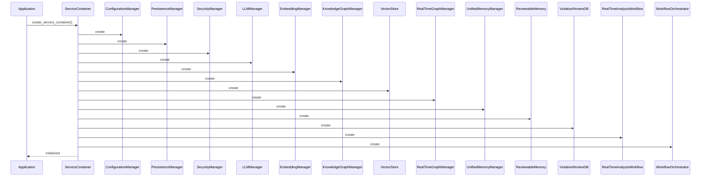

# ServiceContainer Initialization Sequence

```mermaid
sequenceDiagram
    participant App as Application
    participant Container as ServiceContainer
    participant Config as ConfigurationManager
    participant Persistence as PersistenceManager
    participant Security as SecurityManager
    participant LLM as LLMManager
    participant Embed as EmbeddingManager
    participant Graph as KnowledgeGraphManager
    participant Vector as VectorStore
    participant RTGraph as RealTimeGraphManager
    participant Memory as UnifiedMemoryManager
    participant Review as ReviewableMemory
    participant Violations as ViolationReviewDB
    participant Workflow as RealTimeAnalysisWorkflow
    participant Orchestrator as WorkflowOrchestrator

    App->>Container: create_service_container()
    Container->>Config: create
    Container->>Persistence: create
    Container->>Security: create
    Container->>LLM: create
    Container->>Embed: create
    Container->>Graph: create
    Container->>Vector: create
    Container->>RTGraph: create
    Container->>Memory: create
    Container->>Review: create
    Container->>Violations: create
    Container->>Workflow: create
    Container->>Orchestrator: create
    Container-->>App: initialized
```
