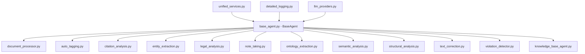
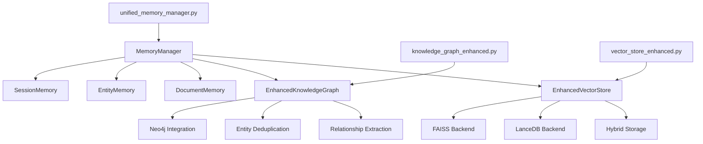
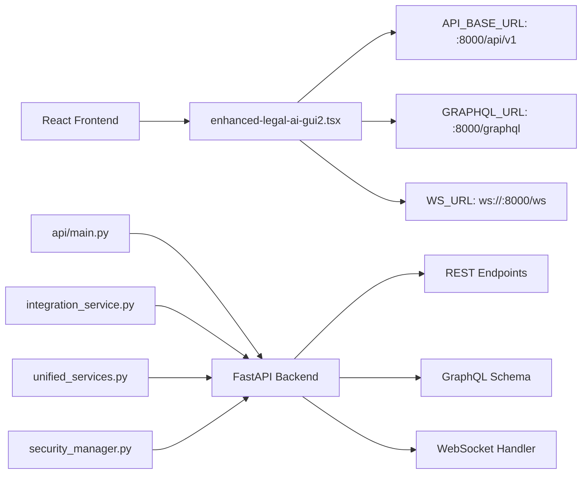
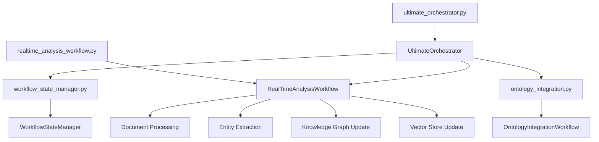
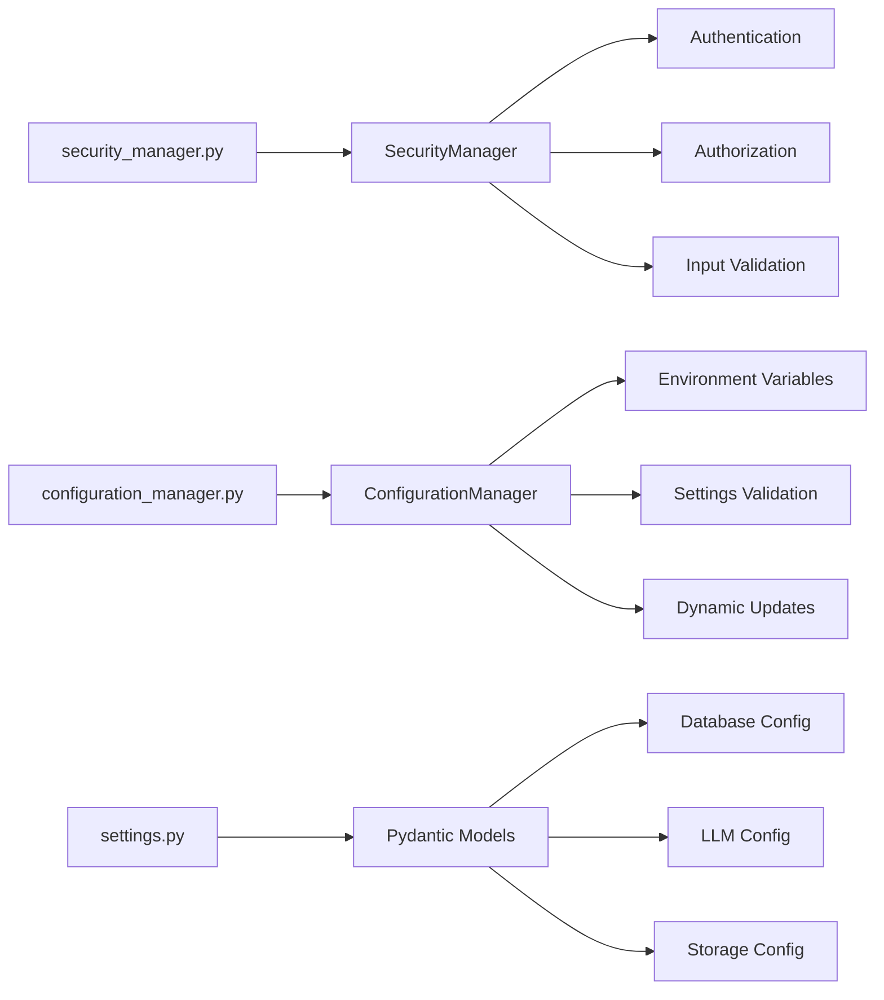

# Legal AI System - Dependency Flow Diagrams

## Core Service Container Flow

```mermaid
graph TD
    A[unified_services.py] --> B[ServiceContainer]
    B --> C[get_service_container()]
    C --> D[40+ Files Import This]
    
    D --> E[api/main.py]
    D --> F[agents/*.py]
    D --> G[core/*.py]
    D --> H[workflows/*.py]
    
    B --> I[LazyServiceProxy]
    I --> J[Resolves Circular Dependencies]
    
    B --> K[ServiceState Enum]
    K --> L[INITIALIZING]
    K --> M[RUNNING] 
    K --> N[SHUTTING_DOWN]
    K --> O[SHUTDOWN]
```

## Agent Inheritance Hierarchy



## LLM Provider Chain

```mermaid
graph LR
    A[llm_providers.py] --> B[BaseLLMProvider]
    B --> C[OllamaProvider]
    B --> D[OpenAIProvider] 
    B --> E[XAIProvider]
    
    F[LLMManager] --> B
    F --> G[provider_fallback()]
    G --> H[Primary: xAI/Grok]
    H --> I[Fallback: Ollama]
    
    J[model_switcher.py] --> F
    J --> K[GrokModelSwitcher]
    K --> L[grok-3-mini]
    K --> M[grok-3-reasoning]
    K --> N[grok-2-1212]
```

## Memory and Knowledge Management



## API and Frontend Integration



## Workflow Orchestration



## Error Handling and Recovery

```mermaid
graph TD
    A[error_recovery.py] --> B[ErrorRecoveryManager]
    B --> C[CircuitBreaker]
    B --> D[RetryManager]
    B --> E[FallbackManager]
    
    F[unified_exceptions.py] --> G[LegalAIException]
    G --> H[ServiceException]
    G --> I[LLMException]
    G --> J[VectorStoreException]
    G --> K[KnowledgeGraphException]
    
    L[detailed_logging.py] --> M[get_detailed_logger()]
    M --> N[66 Files Use This]
```

## Security and Configuration

